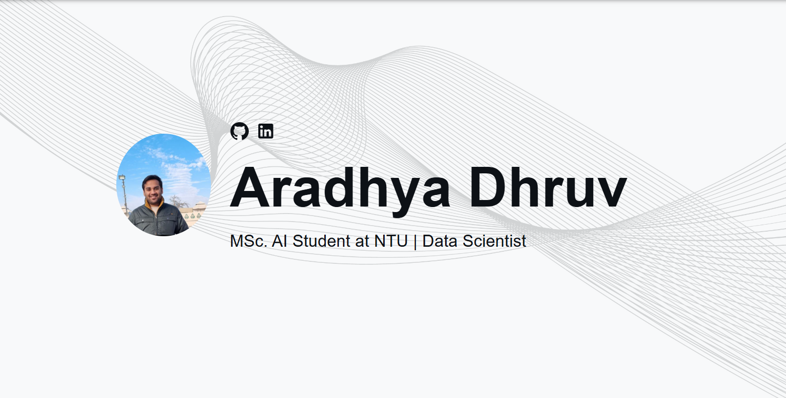

# Aradhya Dhruv's Developer Portfolio 🚀

     

## What is this?

This portfolio is designed to showcase my expertise as a Data Scientist and AI Researcher, highlighting key projects, skills, and career history. It reflects my work in Generative AI, NLP, Computer Vision, and Reinforcement Learning.

The template has been borrowed from Yuji Sato, Kudos to him for creating a dynamic, responsive react portfolio template.

**This template is customized to reflect my profile.** If you find it useful, feel free to fork or download it. Don't forget to leave a ⭐ if you like this portfolio!



## Features

✅ Customized to showcase Generative AI, NLP, and Computer Vision projects  
✅ Highlights professional career and research contributions  
✅ Fully responsive design & mobile-friendly  
✅ Light and dark modes for enhanced usability  
✅ Built with modern web technologies: React, JavaScript, and SCSS  

## Setup Instructions

Follow these steps to set up and customize this portfolio for your own use.

### Prerequisites

Ensure you have [Node.js](https://nodejs.org/) installed. Verify the installation by running:

## Quick Setup

1. Ensure you have [Node.js](https://nodejs.org/) installed. Check your installation by running:

    ```bash
    node -v
    ```

2. In the project directory, install dependencies:

    ```bash
    npm install
    ```

3. Start the development server:

    ```bash
    npm start
    ```

4. Open [http://localhost:3000](http://localhost:3000) to view the app in the browser.

5. Customize the template by navigating to the `/src/components` directory. Modify texts, pictures, and other information as needed.

The page will reload if you make edits, and you will see any lint errors in the console.

If you are interested in creating a mockup image like the ones from the personal projects section, I recommend [Genmoo](https://gemoo.com/tools/browser-mockup-generator/). This website lets you generate sleek looking browser mockups for free.

## Deployment

You can choose your preferred service (e.g., [Netlify](https://www.netlify.com/), [Render](https://render.com/), [Heroku](https://www.heroku.com/)) for deployment. One of the easiest ways to host this portfolio is using GitHub Pages. Follow the instructions below for a production deploy.

1. **Set Up GitHub Repository**

    Create a new repository on GitHub for your portfolio app.

2. **Configure `package.json`**

    Edit the following properties in your `package.json` file:

    ```json
    {
        "homepage": "https://yourusername.github.io/your-repo-name",
        "scripts": {
            "predeploy": "npm run build",
            "deploy": "gh-pages -d build",
            ...
        }
    }
    ```

    Replace `yourusername` with your GitHub username and `your-repo-name` with the name of your GitHub repository.

3. **Deploy to GitHub Pages**

    Run the following command to deploy your app:

    ```bash
    npm run deploy
    ```

4. **Access Your Deployed App**

    After successfully deploying, you can access your app at `https://yourusername.github.io/your-repo-name`.
